# nlp_middle_tier

- Server IP: 10.200.23.42 (UAT)
- Script directory:  /opt/etnet/nlp_preprocessing
-------------------------------------------------------------------------------------------------------------------------------------------------------------------------

# Workflow of NLP middle tier and its relationship with NLP backend
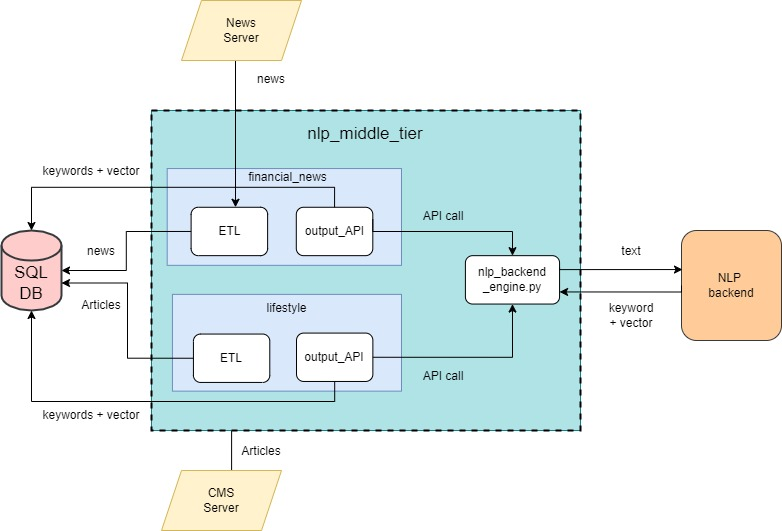

-------------------------------------------------------------------------------------------------------------------------------------------------------------------------

# structure of project
- [Config](https://github.com/etnetapp-dev/nlp_middle_tier/tree/master/Config) - stores configuation of the project in [yaml files](https://github.com/etnetapp-dev/nlp_middle_tier/tree/master/Config/yamls) and contains scripts to convert configuration into reusable python objects.
- [financial_news](https://github.com/etnetapp-dev/nlp_middle_tier/tree/master/financial_news) - contains [ETL](https://github.com/etnetapp-dev/nlp_middle_tier/tree/master/financial_news/ETL) for data retrival of etnet financial news and [output_API](https://github.com/etnetapp-dev/nlp_middle_tier/tree/master/financial_news/output_API) to perform NLP application to news data
- [lifestyle](https://github.com/etnetapp-dev/nlp_middle_tier/tree/master/lifestyle) - contains [ETL](https://github.com/etnetapp-dev/nlp_middle_tier/tree/master/lifestyle/ETL) for data retrival of lifestyle articles and [output_API](https://github.com/etnetapp-dev/nlp_middle_tier/tree/master/flifestyle/output_API) to perform NLP application to lifestyle textual data
- [nlp_backend_engine.py](https://github.com/etnetapp-dev/nlp_middle_tier/blob/master/nlp_backend_engine.py) - acts as bridge to call functional API from [nlp_backend server](https://github.com/etnetapp-dev/nlp_backend) and to use backend functional locally.
- [tools.py](https://github.com/etnetapp-dev/nlp_middle_tier/blob/master/tools.py) and [sql_db.py](https://github.com/etnetapp-dev/nlp_middle_tier/blob/master/sql_db.py) - provides supplemental functions on data preprocessing and set up connection between python server with SQL database. 

-------------------------------------------------------------------------------------------------------------------------------------------------------------------------

# Structure of financial_news and lifestyle module
    - ETL
         input_api.py  (provide in-built functions to call external API for data retrival)
         sql_query.py (provide python-based CRUD functions to communicate with SQL database)
         update_query.py (provide in-built functions for data cleaning and data preprocessing and utilize the function in sql_query.py to complete the workflow of data retrival)
         update_scheduler.py  (set schedule and run at the background to run functions in update_query.py at indicated time interval)
         utils.py  (contains supplementary functions to facilitate data cleaning)         

    - output_API
         nlp_handle.py  (contains in-built function to calculate scores of keywords and provide complete function to vectorize documents)
         vec_scheduler.py (set schedule and run at the background to perform NLP functions in nlp_handle.py at indicated time interval)

-------------------------------------------------------------------------------------------------------------------------------------------------------------------------
# Workflow of ETL module and its relationship with other modules
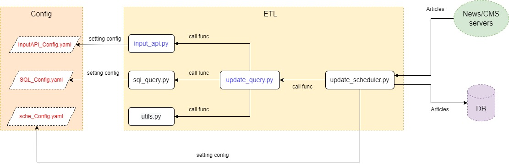

-------------------------------------------------------------------------------------------------------------------------------------------------------------------------

# Workflow of Output API module and its relationship with other modules
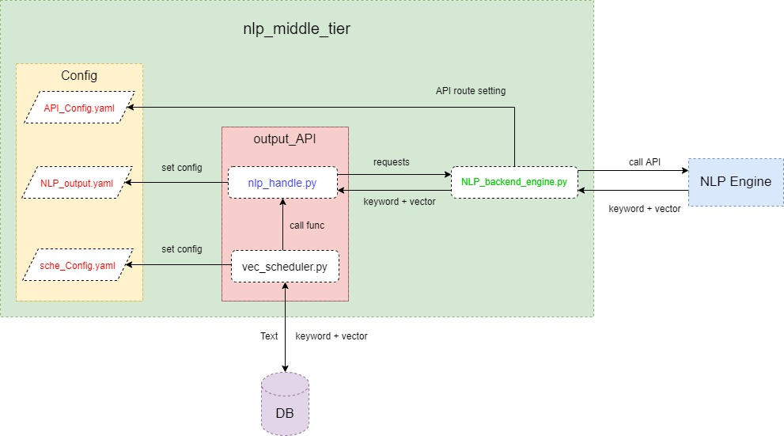

-------------------------------------------------------------------------------------------------------------------------------------------------------------------------         
         

# External APIs of data: all are stored in [InputAPI_Config.yaml](https://github.com/etnetapp-dev/nlp_middle_tier/blob/master/Config/yamls/InputAPI_Config.yaml)
    news:
        content:
            byID: http://10.200.21.82/NewsServer/NGNSHelper/GetNewsContent.do?reqid=2002j&newsid={}&lang=TC
        Thumbnail:
            byTime: http://10.200.23.218/NewsThumbnails/embed/GetNews.do?reqid=2000j&lang=TC&type=N%7CF%7CC&newsdatefrom={}&newsdateto={}&updonfrom={}&updonto={}&packagecd=FV32&limitno={}
            byID : http://10.200.23.218/NewsThumbnails/embed/GetNews.do?reqid=2000j&lang=TC&type=N%7CF%7CC&newsid={}
       
    lifestyle:
        articles: http://10.200.20.9/apps/etnetapp/api/get_columns_data.php?type=latest
        category: http://10.200.20.9/apps/etnetapp/api/get_columns_data.php?type=catinfo
        single_article: http://10.200.20.9/apps/etnetapp/api/get_columns_data.php?type=art&id=
        master: http://10.200.20.9/apps/etnetapp/api/get_columns_data.php?
        section: http://10.200.20.9/apps/etnetapp/api/get_columns_data.php?type=menu
       
    stocknames  
        HK:
            Chi: http://10.200.22.175/StreamServer/SortSearchServlet?reqID=6&category=1&sortFieldID=1&sort=A&from=0&size=5000&customFields=1,2
            Eng: http://10.200.22.175/StreamServer/SortSearchServlet?reqID=6&category=1&sortFieldID=1&sort=A&from=0&size=5000&customFields=1,4
        Shanghai:
            Chi: http://10.200.22.175/StreamServer/SortSearchServlet?reqID=6&category=9&sortFieldID=1&sort=A&from=0&size=5000&customFields=1,2
            Eng: http://10.200.22.175/StreamServer/SortSearchServlet?reqID=6&category=9&sortFieldID=1&sort=A&from=0&size=5000&customFields=1,4
        Shenzhen:
            Chi: http://10.200.22.175/StreamServer/SortSearchServlet?reqID=6&category=11&sortFieldID=1&sort=A&from=0&size=5000&customFields=1,2
            Eng: http://10.200.22.175/StreamServer/SortSearchServlet?reqID=6&category=11&sortFieldID=1&sort=A&from=0&size=5000&customFields=1,4

# article retrival schedule for update_scheduler.py in [sche_Config.yaml](https://github.com/etnetapp-dev/nlp_middle_tier/blob/master/Config/yamls/sche_Config.yaml)
        financial_news:  
            Dayback_minutes: '60'
            day_of_week: mon-fri
            hour: 07-21
            minute: '*/1'
        lifestyle:
            Dayback_minutes: '120'
            day_of_week: mon-sun
            hour: 08-21
            minute: '*/5'

-------------------------------------------------------------------------------------------------------------------------------------------------------------------------

#  Direct run command : 
###  etnet financial news data retrival
     python3.7  /opt/etnet/nlp_preprocessing/financial_news/ETL/update_scheduler.py

###  lifestyle articles data retrival
     python3.7  /opt/etnet/nlp_preprocessing/lifestyle/ETL/update_scheduler.py

###  etnet financial news NLP application
     python3.7  /opt/etnet/nlp_preprocessing/financial_news/output_API/vec_scheduler.py
     
###  lifestyle articles NLP application
     python3.7  /opt/etnet/nlp_preprocessing/lifestyle/output_API/vec_scheduler.py

### Service run command
#### create service script in directory : /usr/lib/systemd/system

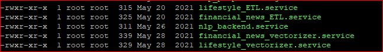

###  etnet financial news data retrival
     systemctl start financial_news_ETL.service

###  lifestyle articles data retrival
     systemctl start lifestyle_ETL.service

###  etnet financial news NLP application
     systemctl start financial_news_vectorizer.service
     
###  lifestyle articles NLP application
     systemctl start lifestyle_vectorizer.service

Note: mainly input “direct run command” in between start) and exit $?

-------------------------------------------------------------------------------------------------------------------------------------------------------------------------

# Steps of keywords extraction and keyword scoring

#### 1.ner_scan
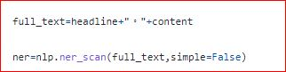

#### 2. pyflashtext instantiation  assign scores based on headine and content
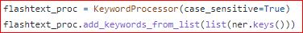
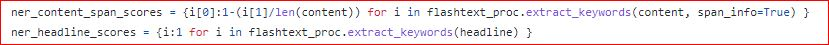

#### 3. assign scores based on name entity type
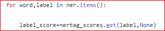

#### 4. Store four types of scores in single array for each vocabulary
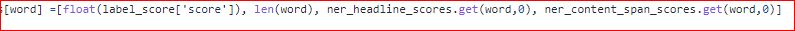

#### 5. Using multiple criteria sorting algorithm to calculate final score of each vocabulary
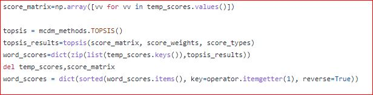

#### 6. Remove duplicated vocabularies in word list by fuzz logic and semantic meaning (word2vec)
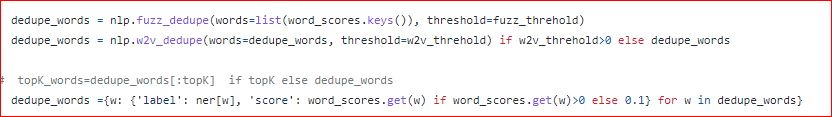

